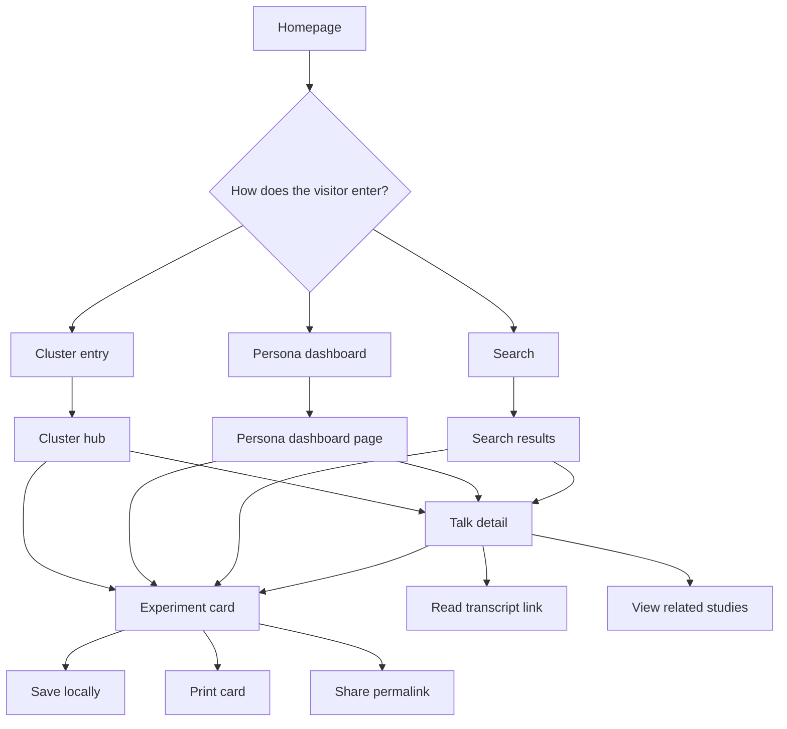
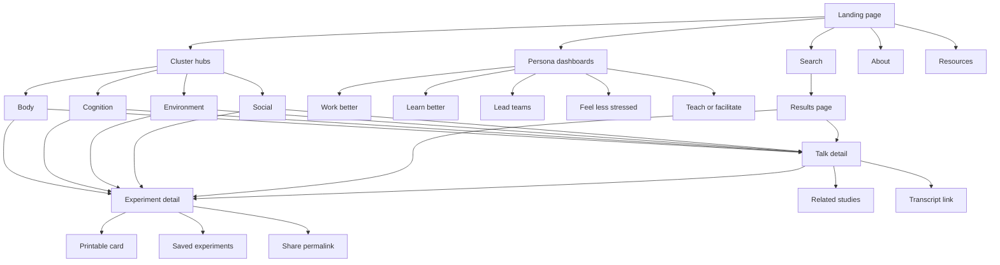

# User Requirements Document for the HAx Static Website

## Executive summary

This product should be a **static, editorially curated discovery site** for “Human Advantage Experiments” drawn from TED Talks: short experiments, habits, reframes, and environmental adjustments that help people improve focus, stress response, creativity, communication, and day design. The site should **not** try to replace TED. It should act as a structured layer on top of TED’s catalog, organizing talks into clusters, behaviors, personas, and evidence levels. That approach is the most defensible product shape because TED permits sharing and contextual embedding of individual talks on **non-commercial** websites using TED embed code, offers transcripts for TED/TEDx talks, and provides interactive transcripts in multiple languages for nearly all talks; TED’s own content guidelines also emphasize accuracy, transparency, and evidence support for factual claims. citeturn12search3turn1search0turn1search2turn21search1turn17search8turn23search0

The recommended implementation is a **static-first architecture** with pre-rendered pages, structured content files, minimal client-side JavaScript, and static search. Among current options, **Astro** is the best primary recommendation because it supports fully static output, build-time content collections, optimized images, and i18n routing, while its islands architecture lets the site keep most pages as lightweight HTML and hydrate only small interactive areas. **Pagefind** is a strong fit for search because it is fully static and indexes the site after build. For deployment, **Cloudflare Pages** or **Netlify** are suitable because both support Git-driven workflows and preview deployments for editorial review before publishing. citeturn8search0turn8search12turn25search3turn25search7turn25search0turn21search0turn26search1turn8search2turn8search6turn8search10turn13search9turn25search1turn25search2

The product should launch as an **English-first, non-commercial MVP** with four core clusters, evidence-tagged talk and experiment pages, persona dashboards, client-side search, tag filters, printable experiment cards, and privacy-minimal analytics. The 12-month direction should extend the corpus, improve evidence linkage, and add multilingual support using TED’s transcript ecosystem rather than creating a parallel video or transcript archive. citeturn21search1turn12search3turn1search0

## Product scope and assumptions

This URD assumes the product owner wants a public-facing, editorial website whose main value is **organization, synthesis, and guided exploration**, not user-generated content or social posting. The following assumptions should be treated as planning defaults until you specify otherwise.

| Assumption area | Working assumption | Requirement implication |
|---|---|---|
| Site purpose | Public editorial knowledge site for HAx topics drawn from TED talks | Curated pages, strong IA, no account-required core experience |
| Business model | Non-commercial at launch | Use TED embed/linking patterns permitted for non-commercial sites; do **not** design around rehosting TED media |
| Content strategy | Summaries, metadata, experiment cards, evidence links, and citations | Treat TED as source-of-record for video and transcript access |
| User accounts | No mandatory login in MVP | “Saved experiments” should default to browser-local storage |
| Language | en-US at launch; multilingual later | Build i18n-ready routes and metadata now |
| Editorial team | Product owner + editor + researcher + developer are assumed roles | Workflow should support review gates even without a large staff |
| Health/legal stance | Informational, not clinical or therapeutic advice | Evidence labels, disclaimers, and outbound source links are required |

TED’s usage help states that TED content is covered by a Creative Commons **BY-NC-ND** license unless otherwise indicated, and TED’s usage policy encourages contextual embedding of individual talks on relevant **non-commercial** sites via TED embed code. TED-Ed also states that its videos may not be downloaded, edited, or redistributed without direct supervision. Therefore the site should be designed around **metadata, summaries, quotes in moderation, and embeds/links**, not local copies of video or full transcript mirrors. citeturn1search0turn12search3turn12search4

The product should also explicitly surface assumptions and gaps rather than hide them, since the site’s value depends on credibility and careful framing of evidence. That principle is consistent with the uploaded requirements-formatting brief. fileciteturn0file0

## Target audiences and personas

The audience is broad, but the usage patterns cluster around people trying to **act on ideas quickly** while preserving enough evidence and context to avoid gimmickry. The personas below are analytical planning constructs rather than externally validated segments.

### Core personas

| Persona | Goals | Tech comfort | Primary tasks |
|---|---|---|---|
| The skeptical knowledge worker | Find practical experiments that improve focus, energy, and time use without hype | High | Search by problem, compare evidence levels, save 3–5 experiments, print or share one |
| The self-optimizing student | Find short, repeatable experiments for study, sleep, procrastination, and memory | High | Browse cognition/body clusters, filter by duration and effort, create a saved list |
| The team lead or manager | Find meeting, communication, and work-environment experiments for teams | Medium | Enter via social/environment dashboard, compare talk summaries, print experiment cards for workshops |
| The coach, educator, or facilitator | Curate cited experiments for classes, workshops, or sessions | Medium | Use persona dashboards, export/print cards, inspect related studies and transcripts |
| The wellness-curious generalist | Explore TED-inspired ideas without feeling overwhelmed | Medium-low | Start at landing page, enter via cluster hub, use progressive disclosure and “start here” content |
| The accessibility-first learner | Consume ideas via text, transcript, keyboard navigation, and print | Medium | Use search, transcript-first detail pages, printable experiment cards, reduced-motion interface |

### Persona-to-user-flow mapping

| Persona | Entry point | Primary tasks | Success metrics |
|---|---|---|---|
| Skeptical knowledge worker | Landing page or search | Compare evidence-tagged experiments for stress, time, meetings | Finds one evidence-backed experiment in under 3 minutes |
| Self-optimizing student | “Learn better” dashboard | Filter by cognition/body, save experiments, read transcript excerpts | Saves at least 3 experiments and returns within a week |
| Team lead or manager | “Lead better meetings” dashboard | Find environment/social experiments, print cards, share permalink | Prints or shares 1–2 team experiments per visit |
| Coach or educator | Resources or persona dashboard | Review studies, talk summaries, create a workshop shortlist | Uses cited pages in external teaching material |
| Wellness-curious generalist | Homepage cluster cards | Browse by cluster, click “try now” experiment cards | Reaches an experiment detail page without using search |
| Accessibility-first learner | Search or resources | Use transcript-first mode, keyboard navigation, print/detail pages | Completes primary task without pointer device and with no serious accessibility blockers |

### Persona flow model



## Content taxonomy and information architecture

The site taxonomy should be **many-to-many**, not a single rigid hierarchy. A single talk may belong to several clusters: for example, Kelly McGonigal belongs in **body** and **social**; Marily Oppezzo belongs in **body** and **environment**; Julian Treasure belongs in **environment** and **social**. TED pages themselves describe these talks in ways that support cross-tagging rather than exclusive categorization. citeturn19search8turn2search10turn20search5turn20search9

### Canonical cluster model

| Cluster | Scope | Canonical TED talks |
|---|---|---|
| Body | Physiology-first levers: posture, stress, sleep, movement, laughter, smiling | [Amy Cuddy — *Your body language may shape who you are*](https://www.ted.com/talks/amy_cuddy_your_body_language_may_shape_who_you_are); [Kelly McGonigal — *How to make stress your friend*](https://www.ted.com/talks/kelly_mcgonigal_how_to_make_stress_your_friend); [Arianna Huffington — *How to succeed? Get more sleep*](https://www.ted.com/talks/arianna_huffington_how_to_succeed_get_more_sleep); [Matt Walker — *Sleep is your superpower*](https://www.ted.com/talks/matt_walker_sleep_is_your_superpower); [Marily Oppezzo — *Want to be more creative? Go for a walk*](https://www.ted.com/talks/marily_oppezzo_want_to_be_more_creative_go_for_a_walk) citeturn18search1turn19search8turn3search0turn2search1turn2search10 |
| Cognition | Habit loops, attention, memory, motivation, procrastination, metacognition | [Judson Brewer — *A simple way to break a bad habit*](https://www.ted.com/talks/judson_brewer_a_simple_way_to_break_a_bad_habit); [Tim Urban — *Inside the mind of a master procrastinator*](https://www.ted.com/talks/tim_urban_inside_the_mind_of_a_master_procrastinator); [Joshua Foer — *Feats of memory anyone can do*](https://www.ted.com/talks/joshua_foer_feats_of_memory_anyone_can_do); [Elizabeth Loftus — *How reliable is your memory?*](https://www.ted.com/talks/elizabeth_loftus_how_reliable_is_your_memory); [Dan Pink — *The puzzle of motivation*](https://www.ted.com/talks/dan_pink_the_puzzle_of_motivation) citeturn19search0turn4search0turn4search1turn4search3turn4search2 |
| Environment | External design levers: meetings, workspace, sound, light, work context | [Nilofer Merchant — *Got a meeting? Take a walk*](https://www.ted.com/talks/nilofer_merchant_got_a_meeting_take_a_walk); [Jason Fried — *Why work doesn't happen at work*](https://www.ted.com/talks/jason_fried_why_work_doesn_t_happen_at_work); [David Grady — *How to save the world (or at least yourself) from bad meetings*](https://www.ted.com/talks/david_grady_how_to_save_the_world_or_at_least_yourself_from_bad_meetings); [Julian Treasure — *The 4 ways sound affects us*](https://www.ted.com/talks/julian_treasure_the_4_ways_sound_affects_us); [Christine Blume — *Why daylight is the secret to great sleep*](https://www.ted.com/talks/christine_blume_why_daylight_is_the_secret_to_great_sleep) citeturn2search2turn5search0turn5search1turn20search5turn20search0 |
| Social | Interpersonal levers: laughter, smiling, listening, speaking, conversation, support | [Sophie Scott — *Why we should take laughter more seriously*](https://www.ted.com/talks/sophie_scott_why_we_should_take_laughter_more_seriously); [Ron Gutman — *The hidden power of smiling*](https://www.ted.com/talks/ron_gutman_the_hidden_power_of_smiling); [Celeste Headlee — *10 ways to have a better conversation*](https://www.ted.com/talks/celeste_headlee_10_ways_to_have_a_better_conversation); [Julian Treasure — *5 ways to listen better*](https://www.ted.com/talks/julian_treasure_5_ways_to_listen_better); [Kelly McGonigal — *How to make stress your friend*](https://www.ted.com/talks/kelly_mcgonigal_how_to_make_stress_your_friend) citeturn7search13turn7search0turn5search2turn20search9turn19search8 |

The evidence model should store **cluster**, **behavior**, **goal**, and **evidence level** separately. That is important because some HAx claims have robust support while others are better treated as suggestive or contested. For example, walking and creativity has direct experimental support from Oppezzo and Schwartz; stress mindset has a defined empirical literature; mindfulness-based habit work has trial evidence; memory methods have neurocognitive evidence; and laughter’s social function is well-supported in the literature. At the same time, talks like Amy Cuddy’s require “mixed/contested” labeling because TED itself notes ongoing robustness and reproducibility debate around some claims. citeturn16search2turn15search1turn15search2turn15search3turn27search0turn27search2turn18search1

### Information architecture



### Page template requirements

| Template | Purpose | Required blocks |
|---|---|---|
| Landing | Explain HAx, provide cluster/persona entry points | Hero, cluster cards, persona cards, featured experiments, search bar, methodology ribbon |
| Cluster hub | Combine editorial framing with faceted discovery | Cluster intro, “start here” experiments, filters, results grid, related clusters |
| Talk detail | Show TED talk in product context | Talk summary, TED embed/link, transcript link, tags, evidence level, related experiments, related studies |
| Experiment detail | Make one experiment actionable | What it is, time cost, instructions, expected effect, evidence notes, contraindications, related talks, print/share/save |
| Persona dashboard | Task-led navigation | Persona goals, recommended clusters, recommended experiments, quick filters, “best first steps” |
| Search/results | Fast discovery | Query box, filters, sort, compact result cards, result-type chips |
| About | Explain methodology and editorial posture | Scope, evidence rubric, citation policy, legal notes, update cadence |
| Resources | Provide trustworthy outbound context | Studies, TED playlists, transcript guidance, glossary, accessibility/help |

### Sample wireframe descriptions

**Cluster hub wireframe**

The top of the page should open with the cluster title, a plain-language explanation of what belongs there, and a short note explaining why this cluster matters. Below that should sit a “Start here” strip with 3–5 editorially chosen experiments. The main body should be a two-column layout on desktop: left rail for filters, right column for results. Filters should include behavior, goal, evidence level, time cost, effort, and persona relevance. Results should use experiment cards first and talk cards second, because the site’s action layer is the core product. The footer of the page should include “Related clusters” and “Methodology for this cluster.”

**Experiment detail wireframe**

The top section should present a one-sentence experiment summary, evidence badge, estimated time cost, and actions for Save, Print, and Share. The next section should be “Try it now,” with step-by-step instructions and a note about when to use the experiment. Beneath that should be an “Why this might work” area summarizing the core claim in neutral language, followed by “What the evidence says,” which links related studies and flags limitations or contestation. The lower page should connect the experiment back to canonical TED talks, transcripts, and adjacent experiments. A final block should state contraindications, category overlaps, and update date.

## Experience requirements

The UX should support **multi-perspective navigation** from day one: by cluster, by behavior, by goal, by persona, and by evidence level. That is more important here than a blog-like chronology because the content is not news; it is evergreen but should feel “queryable.” Users should be able to arrive from “I am stressed,” “I lead meetings,” “I want to learn faster,” or “I’m skeptical—show me the evidence” and land in different entry flows that still resolve to the same underlying content model.

### Prioritized feature table

| Feature | Priority | Effort | Rationale |
|---|---|---:|---|
| Static landing page with cluster and persona entry points | MUST | M | Defines the product clearly and reduces bounce for first-time visitors |
| Cluster hubs for body, cognition, environment, social | MUST | M | Core organizational model requested by the product owner |
| Talk detail pages | MUST | M | Essential bridge back to TED source material |
| Experiment detail pages | MUST | M | Converts inspiration into action |
| Structured metadata with evidence levels | MUST | M | Critical for credibility and filtering |
| Client-side search across pages and JSON content | MUST | M | Required for a static site with broad topical discovery |
| Tag-based filters for behavior, goal, evidence, duration | MUST | M | Needed for “find the right experiment fast” |
| Shareable permalinks | MUST | S | Supports distribution and discussion |
| Printable experiment cards | SHOULD | S | Strong fit for workshops, coaching, and offline use |
| Saved experiments in local browser storage | SHOULD | S | Adds utility without forcing accounts or backend complexity |
| Persona dashboards | SHOULD | M | Makes the site feel guided rather than archival |
| Progressive disclosure on evidence and caveats | SHOULD | S | Keeps pages readable without hiding rigor |
| Transcript-first mode / prominent transcript links | SHOULD | S | Improves accessibility and depth |
| Related studies pages | SHOULD | M | Valuable for skeptical users and educators |
| Multilingual routing and localized metadata | CAN | L | High value later, but not required for MVP |
| Public contributor submissions or comments | CAN | L | Useful only after governance matures; not needed initially |

### UX requirements by behavior

| Requirement area | Requirement |
|---|---|
| Navigation | Users shall be able to browse by cluster, persona, behavior tag, goal tag, and evidence level |
| Discovery | Search shall return talks, experiments, and resources in one unified result set |
| Comprehension | Each experiment page shall begin with a plain-language summary before evidence detail |
| Progressive disclosure | Evidence notes, study links, and limitations shall be collapsible but visible by default above the fold in summarized form |
| Memory and return use | Saved experiments shall persist locally in the browser without requiring login in MVP |
| Portability | Experiment cards shall support clean print styles and shareable URLs |
| Accessibility of complexity | Pages shall offer transcript links, clear headings, semantic landmarks, and low-motion defaults |
| Trust | Each content page shall display source attribution, last reviewed date, and evidence status |

## Technical, governance, and compliance requirements

### Content types and metadata

The content model should be built from a small number of highly structured types.

| Content type | Required metadata |
|---|---|
| Talk | `id`, `slug`, `title`, `speaker`, `ted_url`, `event`, `published_year`, `duration_seconds`, `clusters[]`, `behaviors[]`, `goals[]`, `persona_tags[]`, `summary`, `transcript_url`, `media`, `evidence_level`, `evidence_notes`, `related_experiments[]`, `related_studies[]` |
| Experiment | `id`, `slug`, `title`, `one_line_claim`, `instructions[]`, `time_cost_minutes`, `effort`, `contexts[]`, `contraindications`, `clusters[]`, `behaviors[]`, `goals[]`, `persona_tags[]`, `source_talks[]`, `related_studies[]`, `printable`, `last_reviewed` |
| Study | `id`, `title`, `authors`, `year`, `source_type`, `doi_or_url`, `summary`, `relevance_note`, `evidence_tier` |
| Cluster | `id`, `name`, `description`, `hero_experiments[]`, `canonical_talks[]`, `related_clusters[]` |
| Persona dashboard | `id`, `persona_name`, `goals`, `recommended_clusters[]`, `recommended_experiments[]`, `why_this_path` |
| Resource | `id`, `title`, `type`, `url`, `description`, `license_or_usage_note` |

The **evidence-level** field should be a product-specific editorial rubric informed by standard evidence hierarchies such as OCEBM and GRADE, while also respecting TED’s own emphasis on transparency and support for factual claims. A practical rubric for this site is: **High**, **Moderate**, **Preliminary**, **Mixed/Contested**, and **Narrative/Conceptual**. That is more usable for public readers than transplanting a full clinical evidence taxonomy directly into the UI. citeturn17search0turn17search1turn17search13turn17search8

### Sample JSON schema for an experiment/talk data file

This sample schema is designed for static content files validated at build time.

```json
{
  "$schema": "https://json-schema.org/draft/2020-12/schema",
  "title": "HAx Experiment-Talk Record",
  "type": "object",
  "required": [
    "id",
    "slug",
    "title",
    "record_type",
    "clusters",
    "behaviors",
    "evidence_level",
    "source_talks"
  ],
  "properties": {
    "id": { "type": "string" },
    "slug": { "type": "string" },
    "record_type": { "type": "string", "enum": ["experiment", "talk"] },
    "title": { "type": "string" },
    "speaker": { "type": ["string", "null"] },
    "ted_url": { "type": ["string", "null"], "format": "uri" },
    "event": { "type": ["string", "null"] },
    "duration_seconds": { "type": ["integer", "null"], "minimum": 0 },
    "clusters": {
      "type": "array",
      "items": { "type": "string", "enum": ["body", "cognition", "environment", "social"] }
    },
    "behaviors": {
      "type": "array",
      "items": { "type": "string" }
    },
    "goals": {
      "type": "array",
      "items": { "type": "string" }
    },
    "persona_tags": {
      "type": "array",
      "items": { "type": "string" }
    },
    "summary": { "type": "string" },
    "experiment": {
      "type": ["object", "null"],
      "properties": {
        "one_line_claim": { "type": "string" },
        "instructions": {
          "type": "array",
          "items": { "type": "string" }
        },
        "time_cost_minutes": { "type": "integer", "minimum": 0 },
        "effort": { "type": "string", "enum": ["low", "medium", "high"] },
        "contexts": {
          "type": "array",
          "items": { "type": "string" }
        },
        "contraindications": { "type": ["string", "null"] },
        "printable": { "type": "boolean" }
      }
    },
    "evidence_level": {
      "type": "string",
      "enum": ["high", "moderate", "preliminary", "mixed_contested", "narrative_conceptual"]
    },
    "evidence_notes": { "type": "string" },
    "transcript_url": { "type": ["string", "null"], "format": "uri" },
    "media": {
      "type": "object",
      "properties": {
        "thumbnail": { "type": ["string", "null"] },
        "embed_url": { "type": ["string", "null"], "format": "uri" }
      }
    },
    "source_talks": {
      "type": "array",
      "items": { "type": "string" }
    },
    "related_studies": {
      "type": "array",
      "items": {
        "type": "object",
        "required": ["title", "year", "url"],
        "properties": {
          "title": { "type": "string" },
          "authors": { "type": "string" },
          "year": { "type": "integer" },
          "url": { "type": "string", "format": "uri" },
          "source_type": { "type": "string" },
          "finding_summary": { "type": "string" }
        }
      }
    },
    "last_reviewed": { "type": "string", "format": "date" }
  }
}
```

### Technical stack recommendation

| Layer | Primary recommendation | Alternate(s) | Why |
|---|---|---|---|
| Static site generator | Astro | Eleventy, Hugo | Astro combines static output, content collections, responsive image tools, and built-in i18n routing with minimal-JS islands; Eleventy is simpler; Hugo is strong when content volume and build speed dominate citeturn8search12turn25search3turn25search7turn25search0turn21search0turn26search1turn8search1turn8search5turn13search0 |
| Search | Pagefind | Lunr-style custom index | Pagefind is fully static, works with any static HTML output, and generates the index after build citeturn8search2turn8search6turn8search10 |
| Hosting | Cloudflare Pages or Netlify | GitHub Pages | Cloudflare and Netlify both support Git-based deploys and preview environments; GitHub Pages is viable for low-cost simple hosting of static files citeturn13search9turn25search1turn25search2turn14search8turn14search4 |
| CMS / editorial interface | Decap CMS | TinaCMS | Both fit Git-backed static workflows; Decap is lightweight and repository-native, while Tina adds stronger visual editing citeturn9search0turn9search4turn9search16turn9search1turn9search5turn9search9 |
| Media | Astro image pipeline + responsive images | Optional Cloudinary for large asset libraries | Astro supports optimized responsive images; MDN and Cloudinary guidance both support responsive delivery as a performance requirement citeturn25search0turn25search4turn9search3turn9search15turn9search2turn9search6 |

### Performance and SEO requirements

The site should be static-first for performance, and the build should target **good Core Web Vitals** thresholds: LCP at or under 2.5s, INP at or under 200ms, and CLS at or under 0.1 for the 75th percentile experience. Google states these metrics measure loading performance, responsiveness, and visual stability, and recommends good scores for search success and general user experience. Structured data should be added for `WebSite`, `CollectionPage`, `BreadcrumbList`, and relevant content objects such as `CreativeWork`, because Google uses structured data to understand page content and breadcrumb markup for result categorization. citeturn24search1turn24search3turn24search5turn10search17turn10search5turn10search2

Minimum SEO requirements should therefore include prerendered HTML, stable canonical URLs, XML sitemap generation, Open Graph/Twitter metadata, internal linking between clusters and experiments, and structured breadcrumbs on detail pages. This is a strong fit for static generation because content here is largely evergreen rather than real-time. citeturn10search5turn10search17turn8search12

### Analytics and privacy requirements

The default analytics posture should be **minimal tracking**. The cleanest MVP choice is either no analytics, first-party server log analysis, or a cookieless privacy-first analytics product. Plausible states that its model uses no cookies, no persistent identifiers, and no cross-site or cross-device tracking. By contrast, UK PECR guidance states that cookie rules apply to cookies even if the data is anonymous, and CNIL permits only narrow audience-measurement exemptions under specific conditions. Accordingly, the product should avoid cookies and third-party tracking by default; if non-essential analytics cookies are ever introduced, consent handling should be jurisdiction-aware. citeturn11search0turn11search1turn11search2

**Required privacy decisions for MVP** should be: local-only saved experiments; no mandatory account creation; no behavioral advertising; and no auto-loading of optional third-party scripts before user interaction where practical. If embeds or analytics add legal ambiguity in a target jurisdiction, the safe fallback is a plain outbound TED link instead of an embedded player on first load.

### Authoring workflow and governance

An editorial workflow is essential because the site is making **comparative claims** about experiments, talks, and evidence. TED’s own content guidance emphasizes that claims should be accurate, transparent, and supported, and TED states that curators and fact-checkers work to ensure talks reflect credible public knowledge. The site should adopt the same posture in lighter-weight form. citeturn17search8turn23search0turn23search2

A practical governance model is:

| Role | Responsibilities |
|---|---|
| Product owner | Scope, taxonomy approval, roadmap, final publication signoff |
| Managing editor | Editorial calendar, style consistency, homepage curation |
| Research editor | Study review, evidence-level assignment, citation QA |
| Copy editor | Clarity, tone, readability, metadata hygiene |
| Developer / maintainer | Build pipeline, templates, search index, accessibility and performance QA |

**Editorial policy requirements** should include a citation policy, a standardized evidence rubric, and an update cadence. A reasonable cadence is quarterly review for high-traffic pages and semiannual review for long-tail pages, with immediate updates when a talk’s supporting evidence becomes materially contested or updated.

### Accessibility and legal requirements

The site shall meet **WCAG 2.1 AA** at minimum. W3C defines WCAG 2.1 as the standard for making web content more accessible and notes that WCAG 2.2 adds criteria while keeping 2.1 criteria intact. Skip links should be present and should receive focus early in keyboard navigation to help users bypass repetitive navigation. Automated and manual accessibility testing should combine tools such as Playwright, axe-core, Lighthouse, and WAVE. citeturn8search3turn8search11turn10search3turn10search11turn22search0turn22search4turn22search1turn22search6

On copyright and licensing, the site should assume:
- TED talk pages, summaries, and embeds are the canonical external media source.
- TED content is subject to TED’s usage policy and CC BY-NC-ND terms unless otherwise indicated.
- Full video downloads, edited copies, or mirrored TED-Ed media are out of scope without permission.
- Full transcript replication should not be treated as an MVP feature; the better design is transcript linking, short quoted excerpts where justified, and strong attribution. citeturn1search0turn12search3turn12search4turn1search2

### Testing and QA requirements

| QA area | Requirement |
|---|---|
| Schema validation | All content files shall be validated at build time |
| Link integrity | Internal and external links shall be checked on every production build |
| Search QA | Search index shall be rebuilt and smoke-tested on every deploy |
| Accessibility QA | Every template shall pass automated axe/Lighthouse checks and manual keyboard/screen-reader spot checks |
| Performance QA | Landing, cluster hub, talk detail, and experiment detail pages shall be monitored against CWV targets |
| Editorial QA | No page shall publish without source links, evidence label, and last-reviewed date |
| Print QA | Printable experiment cards shall render legibly on standard US Letter and A4 paper |
| Legal QA | TED embeds, transcript usage, and copyright notes shall be reviewed before launch |

## Launch scope and roadmap

### MVP scope

The MVP should include the landing page, four cluster hubs, talk detail pages, experiment detail pages, at least three persona dashboards, unified search/results, About, Resources, local saved experiments, shareable permalinks, and printable cards. A sensible initial content volume is **40–60 talks/experiments**, enough for density in each cluster without overwhelming the editorial team. More important than volume is consistent metadata, evidence labeling, and coherent cross-linking.

### Milestones

| Time horizon | Recommended outcome |
|---|---|
| Launch | Static site live with four clusters, evidence rubric, search, local saves, and printable cards |
| Three months | Expand content set; refine taxonomy based on analytics and editorial learning; add more persona dashboards; complete formal accessibility remediation |
| Twelve months | Add multilingual routing and localized metadata; deepen related-studies corpus; build editor previews in CMS; consider lightweight account sync only if repeated users demand cross-device saves |

### Open questions and limitations

Some product-critical inputs remain unspecified and should be confirmed before estimation is finalized.

| Open question | Why it matters |
|---|---|
| Will the site remain strictly non-commercial? | TED embedding and reuse rules are materially easier under a non-commercial model citeturn12search3turn1search0 |
| Do you want only TED talks, or also TEDx and TED-Ed? | Licensing, evidence consistency, and editorial volume change meaningfully across these sources citeturn12search4turn21search1 |
| How many editors/reviewers will be available after launch? | Governance, update cadence, and corpus size depend on staff capacity |
| Is user account functionality desired after MVP? | Cross-device saved experiments would move the product beyond a pure static site |
| Will any pages make stronger health or therapeutic claims? | That would require stricter review and legal/editorial caution |

On balance, the best plan is to treat HAx as a **credible, static, evidence-aware TED companion**: embed-first, transcript-linked, richly tagged, persona-guided, and aggressively simple in its technical architecture. That gives the development team a predictable build scope and gives the editorial team a trustworthy product model.